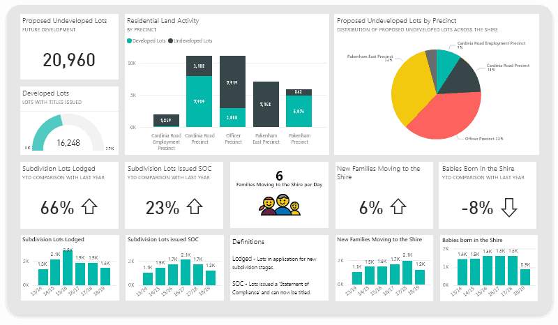

# FCB Day-2 First Project
## Project Overview
---
This Data Analysis Project is the first project for the day two of the Incubatorsng's Future Clan Bootcamp, Data Analysis Class. 

## Data Sources
---
The primary source of data used here is Sales Data.csv and this is an open source data that can be freely downloaded from an open source online such as **Kaggle** or **Fred**

## Tools Used
- Ms Excel for Data Cleaning [Download Here](https://microsoft.com)
- Ms Power BI
- Python
- SQL


```
Google Sheet

SELECT * FROM TABLE 1
WHERE CONDITION = MET

```



|SN |State | Net Revenue | Gross Revenue|
| -----| -----| -----| -----|
|1.| Lagos| 1,081,640 | 1,250,000 |
|2.| Ondo | 458,750 | 620,450 |
|3.| Abuja| 336,625 | 417,695 |
|4.| Rivers | 328,750 | 405,450 |
|5.| Edo| 315,625 | 401,695 |
|6.| Anambra| 288,650 | 392,000 |
|7.| Akwa Ibom | 258,750 | 320,450 |
|8.| Delta| 236,625 | 317,695 |
|9.| Osun | 228,750 | 310,450 |
|10.| Gombe| 206,625 | 297,695 |


